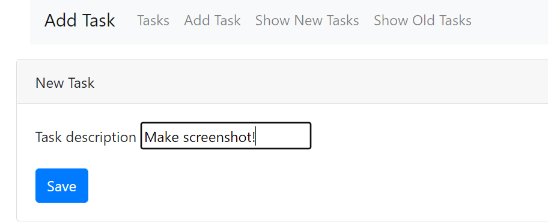

<h1>job4j_todo</h1>
Проект «TODO» — это учебный проект, который представляет собой просто список дел. Проект создан с использованием технологии Spring Boot.
Пользователь может создавать/ редактировать задачи. Все записи сохраняются в базу данных.  

Используемые технологии в проекте:
- Spring boot 2.7.3
- Thymeleaf,
- Bootstrap,
- PostgreSQL 42.2.9
- h2database 2.1.214
- hibernate 5.6.11
- lombok 1.18.22
- Junit 4.13.2
- Hamcrest 1.3
- Mockito 4.0.0
- checkstyle-plugin 3.1.2
- puppycrawl 9.0
- Liquibase 4.15.0

Необходимое окружение:
- Java 17
- Maven 3.8.6
- PostgreSQL 14

Для запуска приложения необходимо:

1. Создать базу данных с именем todo
```sql
    create database todo;
```

2. Собрать проект и запустить приложение Spring Boot
```
    mvn clean install
    mvn spring-boot:run
```

### Основная страница со списком дел:


### Страницы добавления и редактирования:



По всем вопросам по данному проекту вы можете написать мне на email kuptsovns@gmail.com


<h1>job4j_todo</h1>

TODO is a training project of simply a to-do list. The project is based on the Spring Boot technology.
The user is able to create/edit tasks. All entries are saved in the database. 


Technologies used in the project:
- Spring boot 2.7.3
- Thymeleaf,
- Bootstrap,
- PostgreSQL 42.2.9
- h2database 2.1.214
- hibernate 5.6.11
- lombok 1.18.22
- Junit 4.13.2
- Hamcrest 1.3
- Mockito 4.0.0
- checkstyle-plugin 3.1.2
- puppycrawl 9.0
- Liquibase 4.15.0

Necessary environment:
- Java 17
- Maven 3.8.6
- PostgreSQL 14

To run the application you need:

1. Create a database named todo
```ql
    create database todo;
```

Build the project and run the Spring Boot application
```
    mvn clean install
    mvn spring-boot:run
```


#### Main to-do list page:


#### Add and edit pages:


If you have any questions about this project, please email me at kuptsovns@gmail.com